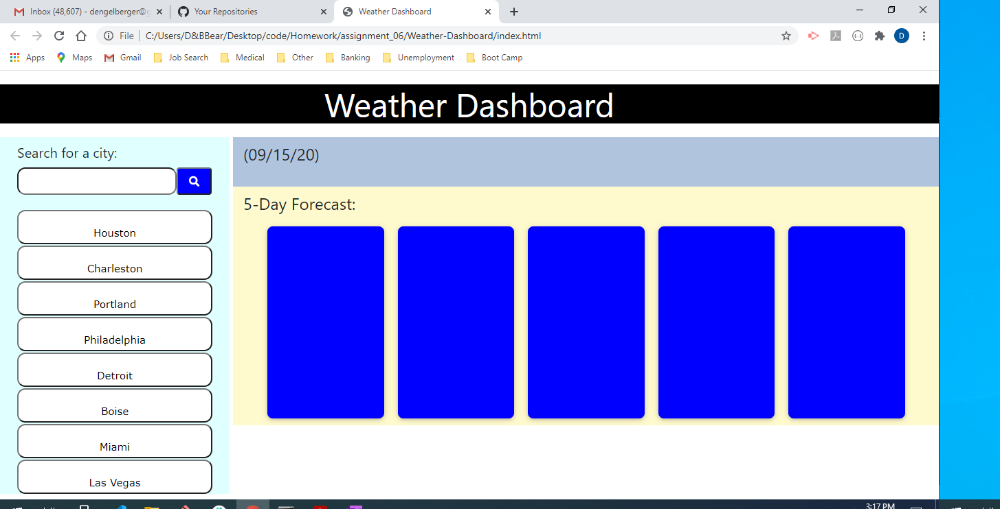
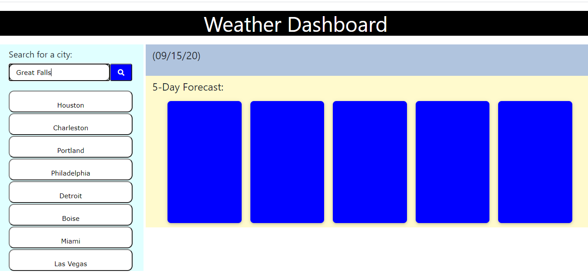
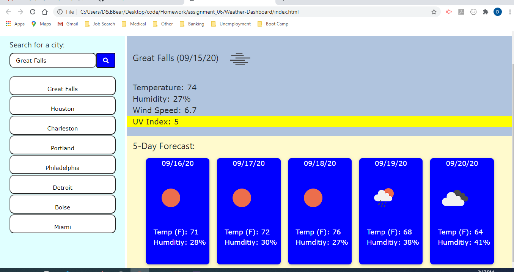
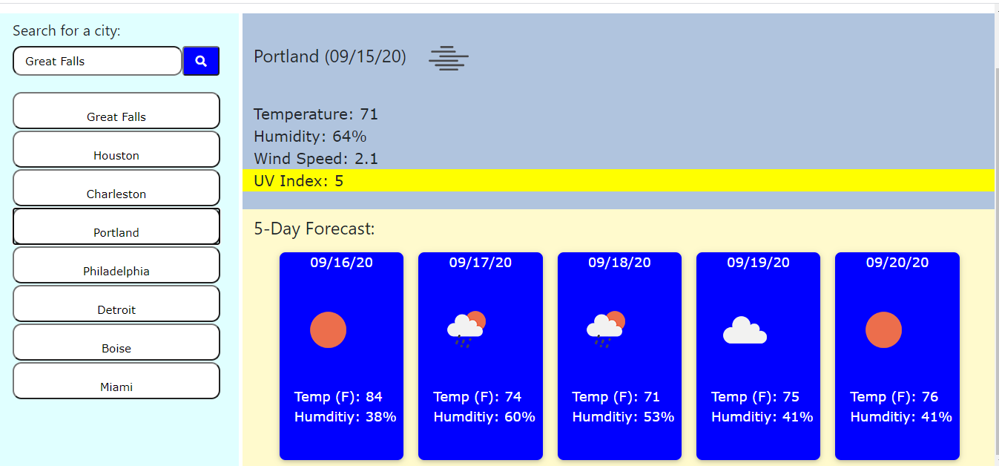

# Weather-Dashboard

For this project we had to create an interactive weather dashboard that showed specific information for a city entered into search. It captured and displayed current data as well as a five-day forecast for that location using API's and AJAX on the back-end development. It also saved the last 8 cities that have been searched, not counting duplicates.

I used a local storage array to record and save all the search history, then included code that removed duplicate searches and returned an array that had unique city names to add to the buttons. The array stores in reverse order (using "unshift") so that the most recent search is in position 0 in the array. Then, when the list of buttons on the left gets refreshed, the last searched new city is at the top of the list.

Clicking on any of those buttons in the search history recalls all the information at the right. Here are screenshots of the page in various states:
 

 

 

 

 

I tried to utilize many of the techniques we learned in class this week as part of my coding, as well as drawing from the CSS coding we learned earlier. Also I learned how to insert special characters and icons.

There are other things I wanted to do for this page, but ran out of time. I would have liked my UVI color coding to be just around the number and not a stripe across the page.  Also, I wanted the user to be able to enter a city name into the search box and just press enter.  Third, I wanted to add a degree sign with the F for the Farenheit temperatures.  All in all, I think I have everything required and will strive to add the niceties in the future.

I hope you enjoy my weather dashboard!